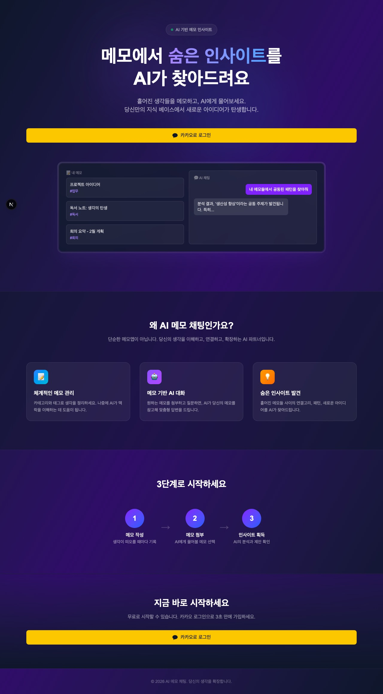

# AI 메모 채팅

> 메모에서 숨은 인사이트를 AI가 찾아드려요

흩어진 생각들을 메모하고, AI에게 물어보세요. 메모를 첨부하면 AI가 맥락을 이해하고 요약, 패턴 분석, 아이디어 확장 등 맞춤형 인사이트를 제공합니다.



<details>
<summary><b>더 많은 스크린샷 보기</b></summary>

| 메모 관리 | AI 채팅 |
|:---------:|:-------:|
|  |  |

| 모바일 메모 | 모바일 채팅 |
|:----------:|:----------:|
|  |  |

> 스크린샷이 보이지 않는다면 `docs/` 폴더에 이미지를 추가해주세요.

</details>

---

## 주요 기능

### 1. 메모 관리
- 카테고리 기반 메모 분류 및 태그 시스템
- 카테고리별 컬러 구분으로 시각적 정리
- 검색, 필터링을 통한 빠른 메모 탐색
- 플로팅 버튼을 통한 어디서든 빠른 메모 작성

### 2. AI 채팅 (메모 기반 RAG)
- 메모를 첨부하여 AI에게 맥락 기반 질문
- OpenRouter API를 통한 다양한 LLM 모델 지원
- 실시간 스트리밍 응답 (SSE)
- 채팅 세션 관리 및 히스토리

### 3. AI 모델 큐레이션
- 무료/유료 유명 모델만 선별 제공
- 무료: DeepSeek R1, GPT-OSS, Llama 3.3, Mistral, Gemma 등
- 유료: Claude Opus 4.6, GPT-4.1, Gemini 2.5 Pro, Grok 4 등
- 사용자별 기본 모델 설정 저장

### 4. 카카오 소셜 로그인
- NextAuth 기반 OAuth 2.0 인증
- JWT 세션 관리 (30일 유지)
- Supabase에 사용자 프로필 자동 동기화

---

## 기술 스택

| 영역 | 기술 |
|------|------|
| **Frontend** | Next.js 15 (App Router), React 19, TypeScript 5.9 |
| **Styling** | Tailwind CSS 4, 반응형 모바일 우선 설계 |
| **상태 관리** | Zustand (클라이언트), TanStack React Query (서버) |
| **인증** | NextAuth v4 + 카카오 OAuth |
| **Database** | Supabase (PostgreSQL) |
| **AI/LLM** | OpenRouter API (SSE 스트리밍) |
| **검증** | Zod v4, React Hook Form |

---

## 아키텍처

```
┌─────────────────────────────────────────────────────┐
│                    Next.js App Router                │
│  ┌───────────┐  ┌───────────┐  ┌─────────────────┐  │
│  │  Landing   │  │   Memos   │  │   AI Chat       │  │
│  │  Page      │  │   CRUD    │  │   (Streaming)   │  │
│  └───────────┘  └───────────┘  └─────────────────┘  │
│                        │                │            │
│  ┌─────────────────────┴────────────────┘            │
│  │              API Routes (Route Handlers)           │
│  │  /api/memos  /api/categories  /api/chat/stream    │
│  │  /api/models /api/user/preferences                │
│  └──────┬──────────────┬──────────────┬──────────────┘
│         │              │              │               │
└─────────┼──────────────┼──────────────┼───────────────┘
          │              │              │
   ┌──────▼──────┐ ┌────▼─────┐ ┌──────▼──────┐
   │  Supabase   │ │ NextAuth │ │ OpenRouter  │
   │ PostgreSQL  │ │  Kakao   │ │  LLM API    │
   └─────────────┘ └──────────┘ └─────────────┘
```

### 주요 설계 결정

- **App Router**: Next.js 15의 서버 컴포넌트를 활용하여 초기 로딩 성능 최적화
- **SSE 스트리밍**: AI 응답을 `ReadableStream`으로 실시간 전달, `AbortController`로 세션 전환 시 스트림 격리
- **큐레이션 모델**: OpenRouter의 400+ 모델 중 검증된 유명 모델만 하드코딩 리스트로 관리
- **Zustand + React Query**: UI 상태(모델 선택 등)는 Zustand, 서버 데이터(모델 목록, 채팅 세션)는 React Query로 역할 분리

---

## 프로젝트 구조

```
src/
├── app/                          # Next.js App Router
│   ├── api/                      # API Route Handlers
│   │   ├── auth/[...nextauth]/   # 카카오 소셜 로그인
│   │   ├── categories/           # 카테고리 CRUD
│   │   ├── chat/                 # 채팅 API
│   │   │   ├── stream/           # SSE 스트리밍 응답
│   │   │   └── sessions/         # 세션 관리
│   │   ├── memos/                # 메모 CRUD
│   │   ├── models/               # AI 모델 조회/동기화
│   │   └── user/preferences/     # 사용자 설정
│   ├── chat/                     # AI 채팅 페이지
│   ├── memos/                    # 메모 관리 페이지
│   └── page.tsx                  # 랜딩 페이지
├── components/                   # React 컴포넌트
│   ├── memo/                     # 메모 관련 (카테고리, 태그, 칩)
│   ├── model/                    # 모델 선택기
│   ├── overlay/                  # 모달
│   ├── ChatInterface.tsx         # 채팅 인터페이스 (스트리밍)
│   ├── ModelSelector.tsx         # 모델 선택 UI
│   └── Header.tsx                # 네비게이션 헤더
├── hooks/                        # 커스텀 React 훅
├── lib/                          # 유틸리티/서비스
│   ├── auth.ts                   # NextAuth 설정
│   ├── openrouter.ts             # OpenRouter API + 큐레이션 모델
│   └── validations/              # Zod 스키마
├── store/                        # Zustand 스토어
├── store-query/                  # React Query 옵션
└── types/                        # TypeScript 타입 정의
```

---

## 시작하기

### 사전 요구사항

- Node.js 22+
- Supabase 프로젝트
- 카카오 개발자 앱 (OAuth)
- OpenRouter API 키

### 설치

```bash
git clone https://github.com/carpediem804/reposter.git
cd reposter
npm install
```

### 환경변수 설정

`.env.local` 파일을 프로젝트 루트에 생성합니다:

```env
# NextAuth
NEXTAUTH_URL=http://localhost:3000
NEXTAUTH_SECRET=your-secret-key

# 카카오 OAuth
KAKAO_CLIENT_ID=your-kakao-client-id
KAKAO_CLIENT_SECRET=your-kakao-client-secret

# Supabase
NEXT_PUBLIC_SUPABASE_URL=https://your-project.supabase.co
SUPABASE_SERVICE_ROLE_KEY=your-service-role-key

# OpenRouter
OPENROUTER_API_KEY=your-openrouter-api-key
```

### 실행

```bash
npm run dev
```

`http://localhost:3000`에서 확인할 수 있습니다.

---

## 지원 AI 모델

### 무료

| 모델 | 제공사 | 특징 |
|------|--------|------|
| DeepSeek R1 0528 | DeepSeek | 추론 특화 |
| GPT-OSS 120B | OpenAI | 오픈소스 대규모 |
| Llama 3.3 70B | Meta | 범용 고성능 |
| Hermes 3 405B | Nous Research | Llama 3.1 기반 |
| Qwen3 Coder | Qwen | 코딩 특화 |
| Mistral Small 3.1 | Mistral | 경량 고효율 |
| Gemma 3 27B | Google | 경량 범용 |

### 유료

| 모델 | 제공사 | 특징 |
|------|--------|------|
| Claude Opus 4.6 | Anthropic | 최고 성능 |
| Claude Sonnet 4.6 | Anthropic | 가성비 |
| GPT-4.1 | OpenAI | 최신 플래그십 |
| o4 Mini | OpenAI | 추론 특화 |
| Gemini 2.5 Pro | Google | 100만 토큰 컨텍스트 |
| Grok 4 | xAI | 200만 토큰 컨텍스트 |
| DeepSeek R1 0528 | DeepSeek | 무제한 호출 |
